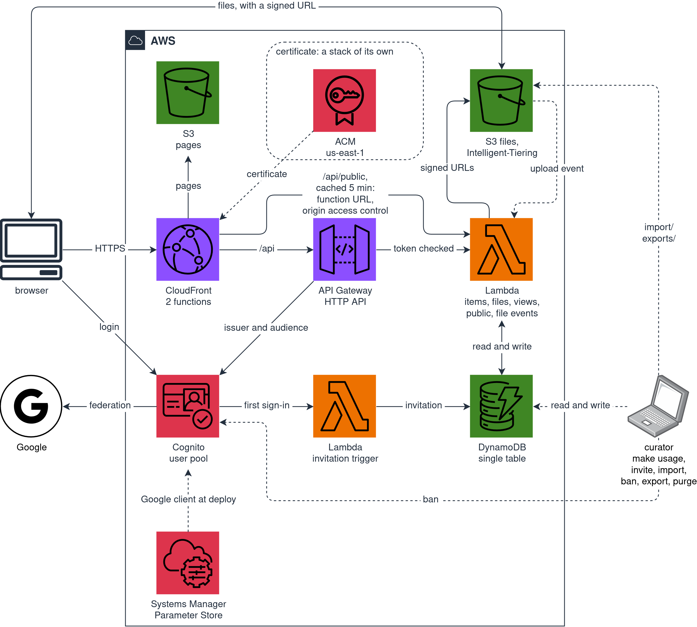
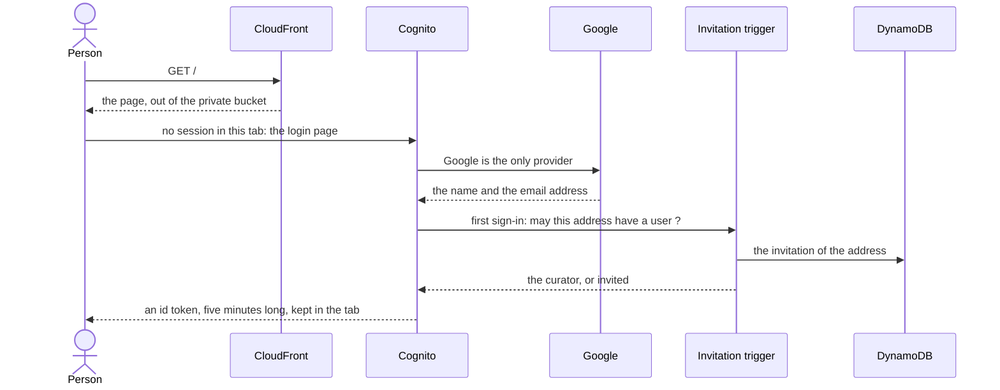
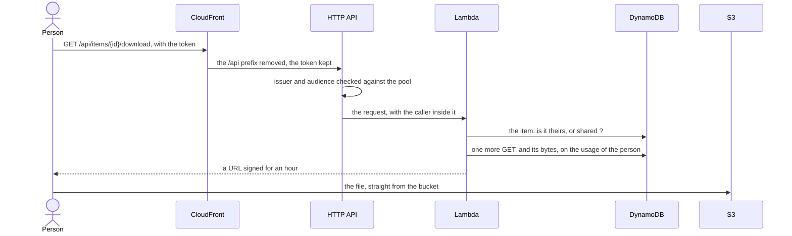
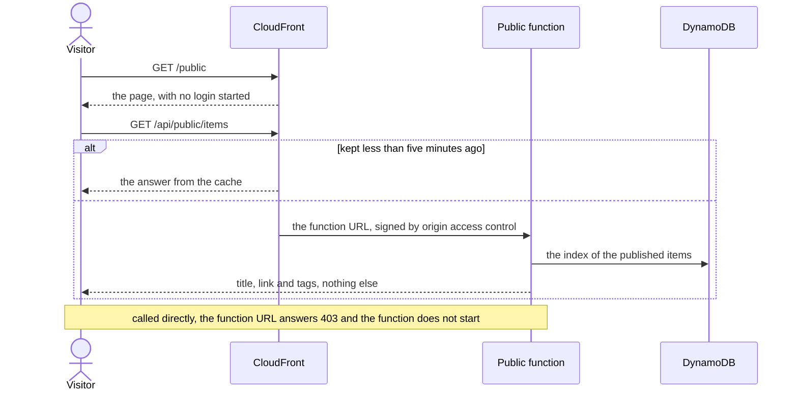

# My Bookmarks - since 2026

Bookmarks on AWS: links, files on Amazon S3 and short notes, organized in ordered folders and filtered by tags, shared by invitation, with a public page for the links the curator publishes.

## Architecture



The site and the API answer on one address. CloudFront serves the pages out of a private S3 bucket and forwards `/api` to the HTTP API, so the browser talks to a single origin. Two CloudFront Functions: one removes the `/api` prefix before the API sees the path, the other answers the routes of the app with `index.html`. `/api/public/*`, the only read without a login, has a behavior of its own: CloudFront keeps its answer five minutes, and asks for it through the function URL of the public function, which takes only the requests the distribution signs. So the public page reaches the function at most once every five minutes per edge location, and nobody can call it around the cache.

Behind the API there are six Lambda functions, one per group of routes plus the invitation trigger and the one that follows the uploads, and one DynamoDB table for everything: items, folders, tags, personal views, usage and invitations. Three indexes: the items of a folder in their order, the people who share something, and the published items. The counters of folders and tags are written in the same transaction as the item.

The files live in a second private bucket, in the Intelligent-Tiering storage class, and the functions never carry them: the browser uploads and downloads with URLs signed by the one function allowed to, and S3 tells the backend an upload happened, with its size, through an event.

The identity is a Cognito user pool federated with Google, and it keeps no passwords. A trigger runs before a user is created, at the first sign-in, and lets in only the curator and the addresses they invited. The API trusts nothing else: the authorizer checks every token against that pool before any code of this project runs.

The patterns:

- **CloudFront with CloudFront Functions, over a private S3 bucket and over the API alike**: one distribution serves the pages and forwards `/api`, and a cache policy of its own keeps the one public read
- **A Lambda function URL behind CloudFront with origin access control**: the read without a login, which only the distribution may call, so nobody can run up its cost around the cache
- **HTTP API to Lambda to DynamoDB**: six functions over a single table, with sparse indexes for the lists that only some records belong to
- **A Cognito user pool federated with Google, with a pre-signup trigger as the list of invitations**: nobody gets a user without being invited first
- **Presigned URLs and an S3 event**: the files never pass through a function, and only S3 says an upload really happened
- **An ACM certificate in us-east-1 for the alias of the distribution, without Route 53**: a stack of its own, and two CNAME records written by hand in the DNS of the parent domain

The first sign-in, where the invitation is checked:



Opening a file:



The file goes from S3 to the browser; the function checks who may have it, and counts the download. An upload uses a URL signed for fifteen minutes, and the event S3 sends afterwards marks the file as ready and adds its size to the usage.

The public page, with no token:



What each page shows, what each route of the API answers, and the rules the items follow are in [docs/SITE.md](docs/SITE.md).

## Security

**The login**. People sign in with their Google account, and only if they were invited: the trigger that runs before Cognito creates a user refuses every address without an invitation, except the one of the curator, who deployed the system. The browser is a public client, so the flow is authorization code with PKCE and the app client has no secret. The Google client ID and secret are not in this repository: they live in Parameter Store, the secret as a `SecureString`, and the deploy reads them from there.

**The session**. The id token lasts five minutes and the refresh token an hour, the shortest lifetimes Cognito allows, because the bookmarks are private and a token copied by a script in the page would work for an hour at most. They live in the `sessionStorage` of the tab, so closing the tab ends the session. `make ban` deletes the invitation and the user of the pool and signs the person out everywhere: the token already in hand keeps working until it expires, five minutes at most, and a download URL already given until its hour is over.

**The pages**. A script in the page could read everything its person can read, so the pages make one unlikely: the security policy lets them run only the code of the bundle, with no inline code and no `eval`; texts are always inserted as text, never as HTML, and a test fails if the frontend ever tries; a link is accepted only with `http` or `https`. The pages cannot be framed, ask for HTTPS from then on, and send no referrer, so a signed URL does not leak into the logs of another site.

**The files**. The content bucket is private, with all four forms of public access blocked. Nothing reads it but the signed URLs, fifteen minutes to upload and an hour to download, and only the function that signs them has the right to read and write the files.

**The public page**. It is the one route without a login, served by a function that can only read, and it answers only the title, the link and the tags of the items the curator published: the text stays with the owner and the invited. Only the curator publishes, only links, and taking the sharing away takes the publication away. CloudFront reaches the function through its function URL with origin access control: a call that does not come from the distribution is refused before the function starts, so nobody can run up its cost around the cache. The route of the HTTP API to the same function stays for local runs, behind the authorizer like the others.

**The curator**. Whoever holds the AWS account can read every bookmark of everybody, to help when something goes wrong, and the pages say so in their footer.

**Inside**. Each Lambda function has a role of its own, limited to the table and, for the two that need it, to the files. The logs are kept seven days. `make check-deployed` proves the rest from the outside at the end of every deploy.

## Estimated costs

Nothing is charged by the month: there is no Route 53 zone, and the certificate is free. An idle system pays for the storage only.

Taking ten invited people, 20 GB of files, 50 GB of downloads a month, twenty pages opened a day by each person, and a public page visited a thousand times a month:

| Resource | Charged on | Free each month | This month |
|---|---|---|---|
| API Gateway, HTTP API | $1.11 per million requests | 1 million, first year of the account only | under $0.05 |
| Lambda, requests | $0.20 per million | 1 million | $0 |
| Lambda, duration | $0.0000166667 per GB-second | 400,000 GB-seconds | $0 |
| DynamoDB, reads | $0.1415 per million read units | nothing | under $0.10 |
| DynamoDB, writes | $0.705 per million write units | nothing | under $0.01 |
| DynamoDB, storage | $0.283 per GB-month | 25 GB | $0 |
| CloudFront, requests and data out | $0.0120 per 10,000, $0.085 per GB | 10 million, 1 TB | $0 |
| CloudFront Functions | $0.10 per million | 2 million | $0 |
| Cognito, Lite tier | $0.0055 per monthly active user | 10,000 | $0 |
| S3, storage in Intelligent-Tiering | $0.023 per GB-month, frequent access | nothing | $0.46 at most |
| S3, requests | $0.0004 per 1,000 GET, $0.005 per 1,000 PUT | nothing | under $0.01 |
| S3, data out to the internet | $0.09 per GB | 100 GB, across the whole account | $0 |
| CloudWatch Logs | $0.57 per GB ingested | 5 GB | $0 |
| ACM, public certificate | nothing | | $0 |
| **Total** | | | **under $0.70** |

List prices for eu-west-1: those of S3 read from the AWS Pricing API on 27 September 2026, the others taken from the AWS price list of 1 July 2026.

- **Downloads**: they grow with use and leave from S3, not from CloudFront; free within the 100 GB a month of the whole account, $0.09 per GB beyond
- **Storage**: an upper bound; Intelligent-Tiering moves a file nobody opened for thirty days to a cheaper tier, while the estimate prices it all as frequent access
- **Not counted**: the monitoring fee of Intelligent-Tiering, a few thousandths of a dollar for a few thousand files, and the free 100 GB of the account; neither in the page of the usage nor in `make usage`

## Prerequisites

- Node 22 and npm
- Docker, to run DynamoDB Local and the Lambda functions locally
- AWS SAM CLI and AWS CLI

Running everything locally needs nothing else. Deploying needs an AWS account prepared once, and a Google OAuth client for the login: [docs/SETUP.md](docs/SETUP.md) walks through it.

## Usage

From the repository root, `make help` lists the available commands.

### Deployment

One command, `make deploy`, puts the whole system on AWS and checks it. What it does, the variables it reads, the address of its own for the site, the checks, and the teardown that takes the data with it are in [docs/DEPLOYMENT.md](docs/DEPLOYMENT.md).

### The curator

The curator invites and bans from the command line, and reads the usage of everybody:

```sh
export AWS_PROFILE=<profile>
make invite EMAIL=<address>
make ban EMAIL=<address>
make usage
```

An invitation is read at the first sign-in of the address. A ban takes it back, removes the person from the pool and signs them out everywhere; their bookmarks stay where they are until the purge.

After a ban, the curator hands the person their data, then deletes it:

```sh
make export EMAIL=<address>
make purge EMAIL=<address>
```

The export is a zip with the bookmarks in the format of the import, their files and their notes on the shared items of others, and a link to it that lasts seven days.

The shared items of a person are the ones they marked as shared with every invited person, one by one in the form or a whole folder at once: the ones the others find under Shared.

The purge refuses the curator and a person not banned yet, lists the shared items of the person, and asks whether they pass to the curator:

- **yes**: they go under `from/<name>/` of the curator, in their folders, with the same id, so the notes the other invited people wrote on them stay
- **no**, the answer when nothing is typed: they are deleted with the rest

Nothing is deleted until the address is typed again.

### Import

Many bookmarks at once, the public links or a course with its files, come from a CSV file whose header names the columns it fills:

```sh
make import CSV=<file.csv>
```

The columns, where the files go before the import, and what happens when the same file runs again are in [docs/IMPORT.md](docs/IMPORT.md).

### Versioning and changelog

Releases go through Make, which bumps the SemVer version, regenerates `CHANGELOG.md` with git-cliff, and creates the release commit and tag:

```sh
make patch
```

Available levels:

- `make patch`: v0.0.X
- `make minor`: v0.x.0
- `make major`: vx.0.0

Then push the commit together with its tag:

```sh
git push --follow-tags
```

## Project structure

```
core/  # shared domain types, zod schemas, and pure logic: names, paths, positions, tags, permissions, costs
backend/  # Lambda functions, and the scripts of the curator: invitations, usage, import, export, purge, prices
frontend/  # static React site
sam/  # data, identity, backend and site, nested in the root template; the certificate, deployed on its own
local/  # DynamoDB Local, its table, and the environment of sam local
scripts/  # checks on the deployed system
redirect/  # the page that sends the old address of the bookmarks to the public page
docs/  # setup, deployment, the site and the API, the import
images/  # the architecture diagram, as draw.io source and as PNG
.github/workflows/  # the redirect on GitHub Pages
template.yaml  # SAM root template
samconfig.toml  # sam parameters for deploy
Makefile  # root commands, delegating to each block
package.json  # root: versioning and changelog only
cliff.toml  # git-cliff configuration
.npmrc  # release commit message format
```

Each block is self-contained, with its own `package.json`, lockfile, and `Makefile`.

## Development

The whole system runs on the machine, with no AWS account: DynamoDB Local in Docker, the HTTP API through `sam local start-api`, the pages from the Vite development server, which forwards `/api` to it. Locally there is no login: the pages act as one fixed person, sent in a header that the backend accepts only when it runs locally.

```sh
make install
make local-up
make sam-local  # in a shell of its own
make dev  # in another one, then http://localhost:5173
```

The checks come in three levels:

```sh
make test  # the code of every block, the backend against DynamoDB Local
make test-api  # the running API end to end, starting what is missing
make validate  # the templates, the nested ones too
```

`sam local` keeps a container per function while it runs, and removes them when it stops with a Ctrl+C. `make local-down` stops DynamoDB Local, and `make local-clean` also removes any container of the functions left behind.

## Blog post

- [Italian](POST.it.md)
- [English](POST.en.md)

## License

This repo is released under the MIT license. See [LICENSE](LICENSE) for details.
